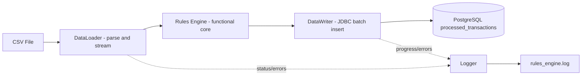
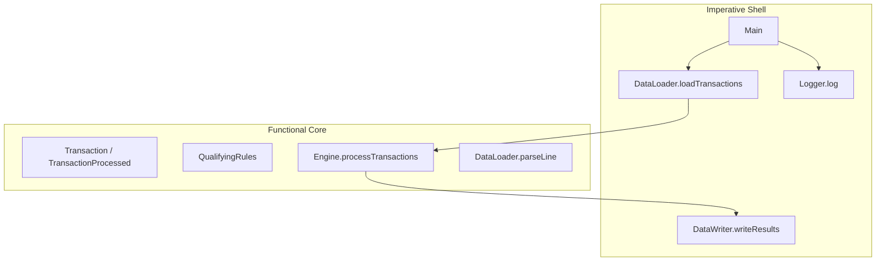
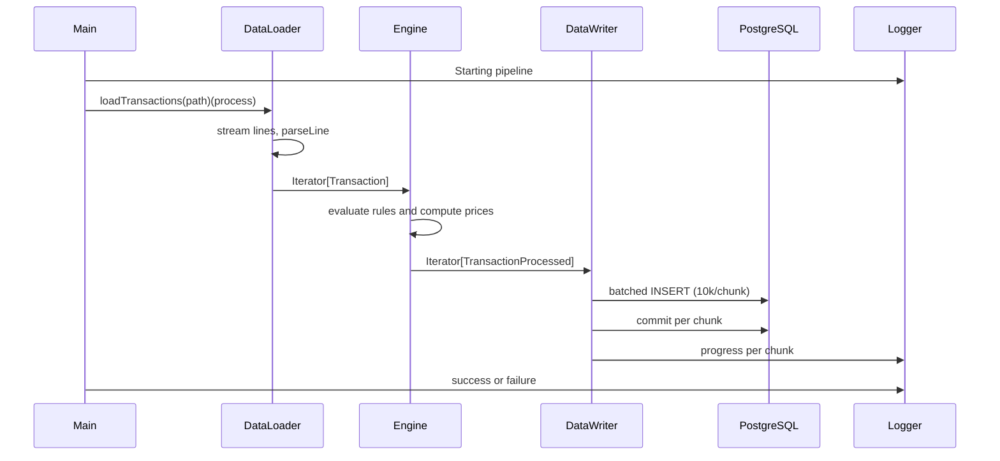

# Retail Rule Engine

A Scala application that ingests retail transactions from CSV, evaluates business discount rules, and persists processed results into PostgreSQL at scale.

## Executive Summary

This project is built around a **Functional Core, Imperative Shell** architecture:

- Functional Core: deterministic pricing logic and domain modeling.
- Imperative Shell: file I/O, database writes, logging, environment configuration, and pipeline orchestration.

The current implementation is optimized to process large input files by streaming records through the rules engine and writing to the database in batches.

## Problem Statement

Given a transaction feed, apply a configurable set of discount rules and compute final transaction pricing while:

- preserving business traceability (which discounts were eligible),
- supporting large file throughput,
- keeping core pricing logic testable and deterministic.

## Architecture At A Glance



## Functional Core vs Imperative Shell



### Why this architecture

1. Testability: the pricing algorithm and rule functions are isolated from side effects.
2. Maintainability: adding or changing business rules does not require changing file or DB code.
3. Scalability: shell handles streaming and batching concerns; core remains focused on transformation.
4. Observability: shell centralizes logging and failure handling.

## Repository Structure

```text
.
|-- build.sbt
|-- project/
|   |-- build.properties
|   `-- metals.sbt
|-- src/main/scala/
|   |-- Main.scala
|   |-- infrastructure/
|   |   |-- DataLoader.scala
|   |   |-- DataWriter.scala
|   |   `-- Logger.scala
|   |-- models/
|   |   |-- Transaction.scala
|   |   `-- TransactionProcessed.scala
|   `-- rules/
|       |-- Engine.scala
|       `-- QualifyingRules.scala
|-- data/
`-- rules_engine.log
```

## Data Contract

Input CSV header:

```csv
timestamp,product_name,expiry_date,quantity,unit_price,channel,payment_method
```

Expected column mapping:

1. timestamp: ISO-8601 timestamp (parsed by `ZonedDateTime.parse`)
2. product_name: string
3. expiry_date: yyyy-MM-dd
4. quantity: integer
5. unit_price: decimal
6. channel: string
7. payment_method: string

## Domain Model

`Transaction`

- timestamp: LocalDateTime
- productName: String
- expiryDate: LocalDate
- quantity: Int
- unitPrice: Double
- channel: String
- paymentMethod: String
- derived field: `daysToExpiry`

`TransactionProcessed`

- originalTransaction: Transaction
- discountApplied: List[Double] (all matched discounts)
- averageDiscount: Double (average of top two matched discounts)
- finalPrice: Double

## Pipeline Behavior



## Rule Evaluation Model

Rules are represented as functions of type:

`Transaction => Double`

Each rule returns either:

- a positive discount percentage (for example 0.10 = 10%), or
- 0.0 when not applicable.

Selection algorithm in engine:

1. Evaluate all rules.
2. Keep positive discounts.
3. Sort descending.
4. Take top 2.
5. Compute average of taken values.
6. Apply to base price: `unitPrice * quantity * (1 - averageDiscount)`.

### Why top-two averaging

This prevents unlimited stacking of all discounts while still rewarding multiple qualifying conditions. It is a compromise between customer incentive and margin control.

## Rule Catalog

### 1) Expiration rule

- Applies if 0 <= daysToExpiry < 30
- Discount = `(30 - daysToExpiry) / 100.0`

### 2) App channel rule

- Applies if channel is `app`
- Discount = `ceil(quantity / 5.0) * 0.05`

### 3) Category rule

- `cheese` -> 10%
- `wine` -> 5%

### 4) Payment method rule

- `visa` -> 5%

### 5) Date rule

- March 23 -> 50%

### 6) Tiered quantity rule

- quantity >= 15 -> 10%
- quantity >= 10 -> 7%
- quantity >= 6 -> 5%

## Design Patterns Used

1. Functional Core, Imperative Shell

- Pure pricing core in rules/models.
- Side-effecting orchestration and persistence in infrastructure/main.

2. Strategy Pattern via Higher-Order Functions

- Rules are pluggable strategies (`Transaction => Double`) in a list.

3. Factory Methods for Rule Construction

- `createCategoryRule`, `createDateRule`, `createTieredQuantityRule`, `createPaymentRule`.

4. Pipeline Pattern

- Loader -> Engine -> Writer using iterator-based flow.

5. Loan Pattern (Resource Safety)

- `Using` and `Using.Manager` for file handles and JDBC resources.

6. Batch Processing Pattern

- DB inserts grouped in chunks of 10,000 for throughput and memory control.

## Performance Decisions And Rationale

### Decision: move from list-based processing to iterator streaming

Why:

- avoids loading entire dataset into memory,
- supports processing very large files,
- allows transformation and persistence to flow record-by-record/chunk-by-chunk.

Tradeoff:

- random access and full in-memory post-analysis are not available without materialization.

### Decision: batched inserts with `reWriteBatchedInserts=true`

Why:

- reduces round trips,
- enables PostgreSQL JDBC optimization for batch statements,
- significantly improves ingestion throughput.

Tradeoff:

- commits are chunk-scoped; partial completion is possible if a later chunk fails.

### Decision: commit per chunk (10,000)

Why:

- balances transactional overhead and rollback scope,
- provides steady progress and operational visibility.

Tradeoff:

- does not guarantee all-or-nothing for the entire file.

## Error Handling Strategy

The pipeline returns nested outcomes:

- outer `Try`: file loading/parsing closure-level failures,
- inner `Try`: database writing failures.

Main handles cases separately:

1. `Success(Success(totalSaved))`
2. `Success(Failure(dbError))`
3. `Failure(fileError)`

Why this design:

- keeps failure source explicit (file stage vs DB stage),
- improves operational diagnostics.

## Logging And Observability

- Logger writes to `rules_engine.log` with timestamp and level.
- DataWriter logs chunk progress after each commit.
- Main logs start/completion/failure.

## Database Contract

The writer inserts into table `processed_transactions` with columns:

- transaction_timestamp (timestamp)
- product_name (text/varchar)
- quantity (int)
- base_price (numeric)
- final_price (numeric)

Suggested DDL:

```sql
CREATE TABLE processed_transactions (
    id SERIAL PRIMARY KEY,
    transaction_timestamp TIMESTAMP NOT NULL,
    product_name VARCHAR(255) NOT NULL,
    quantity INT NOT NULL,
    base_price NUMERIC(10, 2) NOT NULL,
    discount_applied NUMERIC(5, 4) NOT NULL,
    final_price NUMERIC(10, 2) NOT NULL
);
```

## Configuration

Environment variables:

- `DB_URL` (default `jdbc:postgresql://localhost:5432/retail_db?reWriteBatchedInserts=true`)
- `DB_USER` (default `postgres`)
- `DB_PASSWORD` (default placeholder)

Important note:

- The application reads `DB_PASSWORD`.
- If you export `DB_PASS`, it will be ignored.

## Build And Run

Prerequisites:

- JDK compatible with Scala 2.13.x
- sbt 1.12.5
- PostgreSQL accessible with target database/table

Build:

```bash
sbt compile
```

Run:

```bash
# PowerShell example
$env:DB_URL="jdbc:postgresql://localhost:5432/retail_db?reWriteBatchedInserts=true"
$env:DB_USER="postgres"
$env:DB_PASSWORD="your_password"
sbt run
```

By default, Main points to:

- `data\\TRX10M.csv`

For local smoke runs, switch to smaller:

- `data\\TRX1000.csv`

## Evolution Timeline (Decision History)

From commit history:

1. `chore`: project bootstrap and gitignore.
2. `feat`: domain models and functional rules engine.
3. `feat`: infrastructure layer (loader/logger/postgres writer).
4. `feat`: pipeline orchestration in Main.
5. `feat(rules)`: app and visa discount rules.
6. `feat`: streaming iterator refactor + batched write scaling.

Interpretation:

- The architecture evolved intentionally from core logic first to infrastructure and then throughput optimization, which aligns with functional-core-first design.

## Constraints And Known Tradeoffs

1. Parse failures are dropped silently (`parseLine` returns `None` on failure).
2. App rule can theoretically exceed 100% discount for very high quantities.
3. No explicit cap/floor on final discount or final price.
4. No deduplication/idempotency key in DB writes.
5. Partial writes are possible when failure occurs after one or more chunk commits.
6. No test suite currently committed.

## Next Improvements

1. Add validation and dead-letter capture for malformed CSV rows.
2. Add discount caps (for example total <= 0.90) and non-negative final price guard.
3. Add unique business key and idempotent upsert strategy.
4. Add unit tests for each rule and property tests for pricing invariants.
5. Add integration tests with a temporary PostgreSQL instance.
6. Externalize rule configuration to file/database for runtime rule management.

## Security And Operational Notes

1. Never hardcode production credentials.
2. Ensure `rules_engine.log` rotation in long-running environments.
3. Monitor DB write latency and lock/contention with large batches.
4. Validate timezone assumptions from source timestamps.

## Why This Design Is Scalable

- Clear boundary between pure business logic and side effects.
- Strong composability with function-based rules.
- Throughput-oriented ingestion with iterator streaming and JDBC batching.
- Operationally transparent through explicit progress and error logging.
- Easy path for future extensibility (new rules, new sinks, configurable policies).

## License

This project is licensed under the MIT License.

See the LICENSE file for details.
